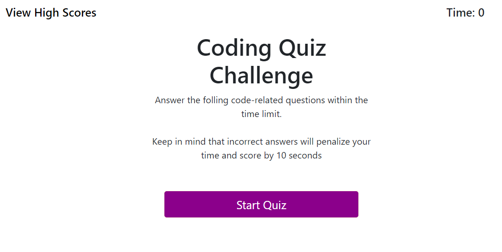

# Challenge: Web-APIs - Code Quiz

Deployable link: https://ajiaholiday.github.io/code-quiz/

## Description
A coding assessment that is a combination of multiple-choice questions and interactive coding challenges. This is a timed coding quiz with multiple-choice questions that runs in the browser, through dynamically updated HTML and CSS powered by JavaScript code.

## Built With
* HTML
* CSS
* JavaScript

## Usage
Click "Start Quiz" and answer all questions. Enter your initials at the end and see your high scores. 

## Images

## Contribution
Made with ❤️ by Ajia Holiday